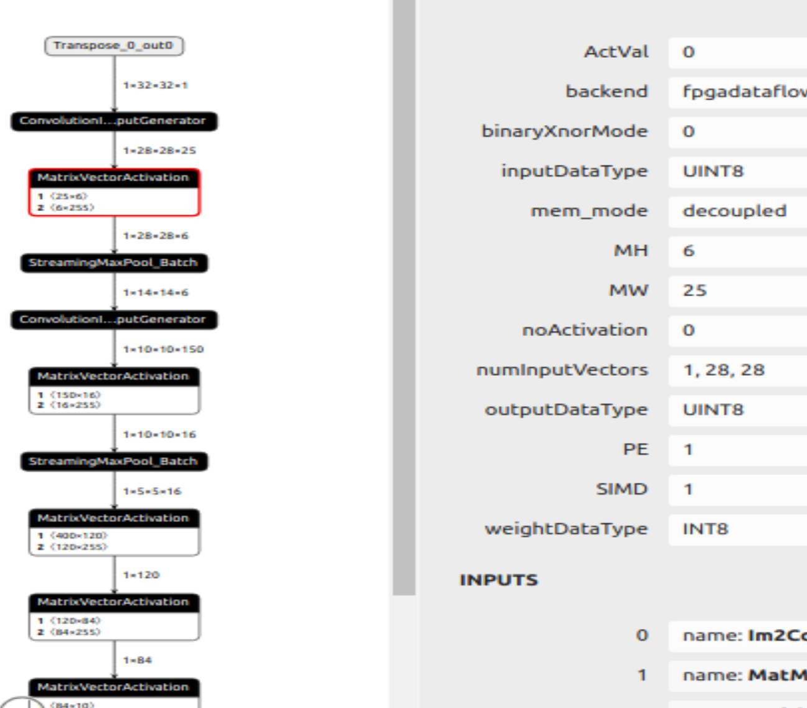
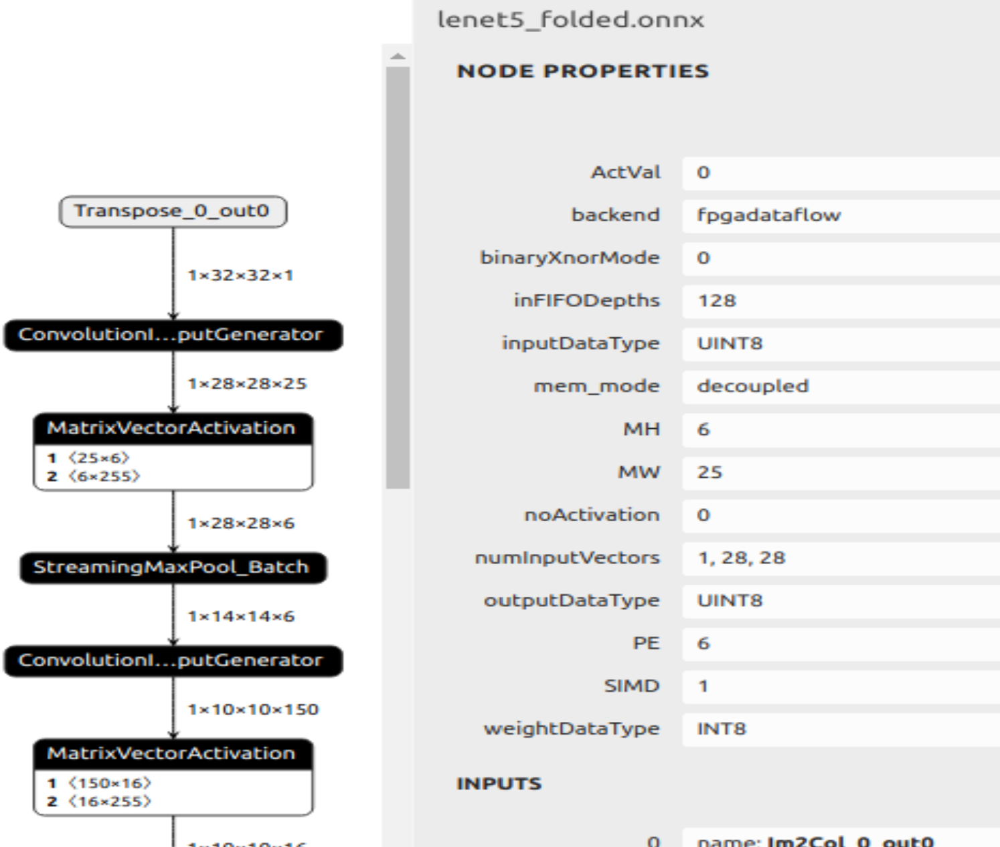

# UofUtah HLS CNN Acceleration 
- Dataflow Accelerators for deep convolutional neural networks via Vitis HLS and Finn compiler for AMD-Xilinx FPGAs.

ANN_MNIST 
--------------------------
- 3 Layer Multilayer Perceptron implemented in Vitis-HLS for MNIST hand written digit recongition. Fully Connected layers represented as Matrix-Vector Multiplication and each layer is fully pipelined and unrolled for maximum throughput and performance. 

Lenet5_Notebooks:
--------------------------------------
- Quantization Aware training for 5 layer CNN (Lenet5) implementation in [Brevitas](https://github.com/Xilinx/brevitas) using 8 bit quantizations for inputs, weights, and activations. Train on MNIST handwritted digits dataset, export to onnx, apply transformations, export to [FINN](https://github.com/Xilinx/finn) for Vitis-HLS acclerator generation and deploy on AMD Kria KV260 SOM for inference evalution via PYNQ.
  

Resnet 50/18 Notebooks:
----------------------------
In progress.

Validation and Results:
Deployed as PYNQ overlay on AMD Kria KV260 SOM. 
